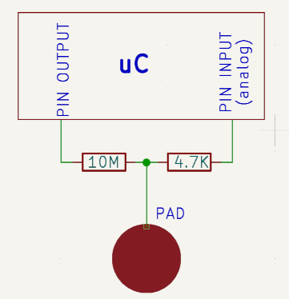

# ADVcapacitiveSensor

## Introduction

### This library and much of this README is based on Takuto Yamana's [FastCapacitiveSensor](https://github.com/Nyanyan/FastCapacitiveSensor) that enable you to use capacitive sensors, but respectely to original this subtract the offset values ​​when it is initialized with begin(). Added booltouch() method that returns only HIGH and LOW boolean values. The example script turns on the LED_BUILTIN. It is recommended to modify the hardware by adding an electrostatic discharge (ESD) protection resistor of at least 4.7Kohm
<p style="text-align: right"><em>Antonio de Vincentiis</em></p>

## Software requirement

This library uses math.h.

## Hardware requirement



The resistor decide the time of charging. receeivePin must be analog input pin.

## How it works

### Basic construction

Capacitive sensors are pseudo capacitors. Your Arduino will measure the time of charging them, and if the time is long, it decides that a conductor touching on the sensor.

### How to sense faster

The equation of the sensed voltage will be:
$$
V = V_0(1-e^{\frac{1}{RC}t})
$$
In this library, the time when $V=0.9V_0$ in units of micro seconds will return.

Actually, we do not have to measure the time until $V$ gets $0.9V_0$. When the time is $t_1$, this library quit timing and sense the voltage $V_1$.

The expected returning time $t_{pre}$ will calculated:
$$
t_{pre} = \frac{\log(1 - 0.9)}{\log(1 - \frac{V_1}{V_0})}t_1
$$

## Usage

See also example program.

### Include

```c++
#include <ADVcapacitiveSensor.h>
```

### Define a class

```c++
ADVcapacitiveSensor sensor1;
```

### Execute begin function

```c++
sensor1.begin(A0, A1, 5.0, 10, 10, 0.2);
```

arguments:

```c++
void begin(sendPin, receivePin, maxVoltage, frequency, breakThreshold, excludeRatio);
```

maxVoltage is the voltage of the sendPin. It is $V_0$.

frequency is how many times the touch function tries sensing.

breakThreshold is the threshold of breaking sensing. The unit is micro seconds. the touch function finish sensing on the breakThreshold time, and after that, calculate the expected time of sensing. It is $t_1$.

excludeRatio is the ratio of exclusion of sensed values. Must be larger than or the same as 0 and smaller than 0.5.

### Sense return analog double

```c++
sensor1.touch()
```

The return value is the sensed (or calculated) time in units of micro seconds. The type is double.

### Sense return bool

```c++
sensor1.booltouch()
```

The return value is bool type (HIGH or LOW), internally the touch() method is called 6 times to make an average.

## License

MIT License

Copyright (c) 2019 to presente - Nyanyan
Copyright (c) 2024 to present - Antonio De Vincentiis 

Permission is hereby granted, free of charge, to any person obtaining a copy
of this software and associated documentation files (the "Software"), to deal
in the Software without restriction, including without limitation the rights
to use, copy, modify, merge, publish, distribute, sublicense, and/or sell
copies of the Software, and to permit persons to whom the Software is
furnished to do so, subject to the following conditions:

The above copyright notice and this permission notice shall be included in all
copies or substantial portions of the Software.

THE SOFTWARE IS PROVIDED "AS IS", WITHOUT WARRANTY OF ANY KIND, EXPRESS OR
IMPLIED, INCLUDING BUT NOT LIMITED TO THE WARRANTIES OF MERCHANTABILITY,
FITNESS FOR A PARTICULAR PURPOSE AND NONINFRINGEMENT. IN NO EVENT SHALL THE
AUTHORS OR COPYRIGHT HOLDERS BE LIABLE FOR ANY CLAIM, DAMAGES OR OTHER
LIABILITY, WHETHER IN AN ACTION OF CONTRACT, TORT OR OTHERWISE, ARISING FROM,
OUT OF OR IN CONNECTION WITH THE SOFTWARE OR THE USE OR OTHER DEALINGS IN THE
SOFTWARE.